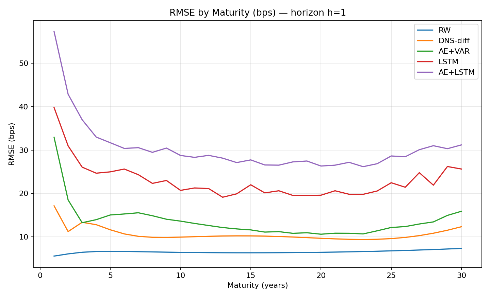
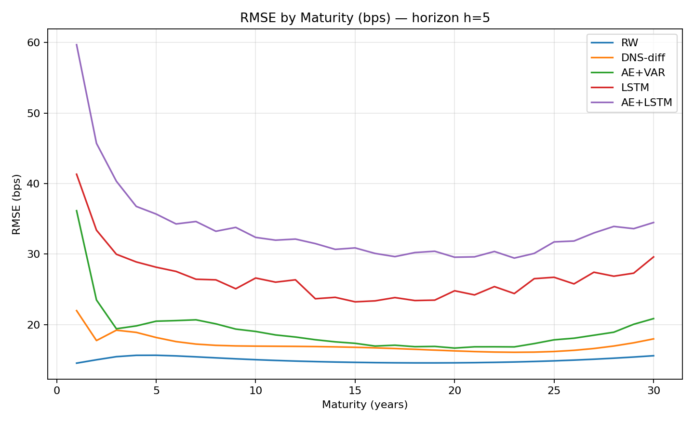
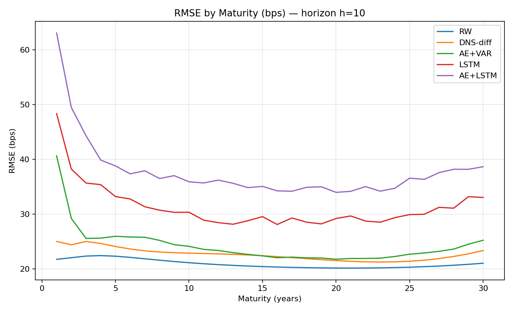
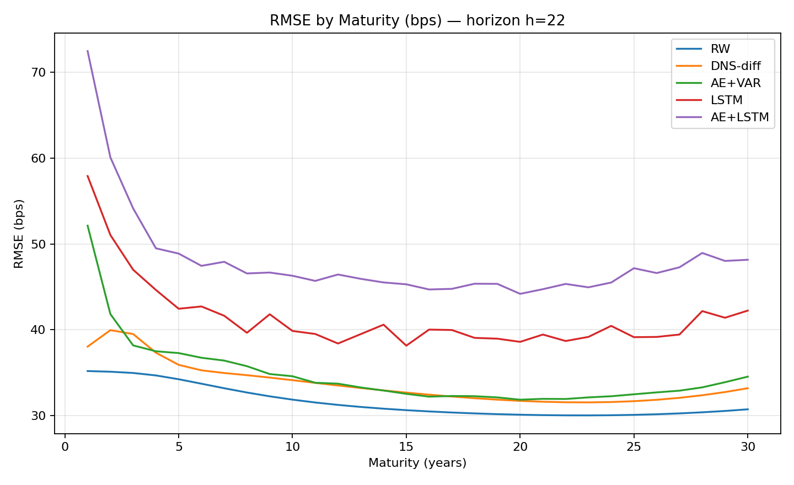

# Yield Curve Forecasting with Machine Learning (vs. Classic Factor Models)

> Daily US nominal yield curve (1960–present). Forecast 30 maturities at horizons **h ∈ {1, 5, 10, 22}**.  
> Compare **Random Walk**, **Dynamic Nelson–Siegel (DNS)**, **Autoencoder+VAR**, **LSTM**, and **AE+LSTM**.  
> **Result:** the **Random Walk** baseline is the best; among learned models **DNS-diff > AE+VAR > LSTM > AE+LSTM**. Gaps narrow with horizon but the ordering is stable.

---

## Why this project?

Yield curves are smooth, persistent time series. A natural question is whether modern ML (deep sequence models, learned latent factors) can **beat simple, strong baselines** and classic factor models **out of sample** when evaluated rigorously. This repo implements a clean, reproducible comparison across methods with identical rolling backtests and robust statistics (Diebold–Mariano tests).

---

## Data & preprocessing

- **Source:** Federal Reserve nominal yield curve (daily), 1960 → present.  
  Early period uses **Nelson–Siegel** parameters; later period uses **Svensson**.
- **Unification:** For *every day* we **re-fit Nelson–Siegel (NS)** to the observed curve and rebuild a **30×1–30y** panel of yields:
  
  $y_t(\tau) \approx \beta_{1,t}   \;+\; \beta_{2,t}\,\frac{1-e^{-\lambda \tau}}{\lambda \tau}   \;+\; \beta_{3,t}\Big(\frac{1-e^{-\lambda \tau}}{\lambda \tau} - e^{-\lambda \tau}\Big).$
  
  This yields a consistent daily panel $Y_t \in \mathbb{R}^{30}$ for maturities $\tau \in \{1,\dots,30\}$ years.

- **Task:** For each day $t$, forecast the entire 30-dim curve at **horizons** $h\in\{1,5,10,22\}$ (business days ahead).

---

## Models

### 1) Random Walk (RW)
The benchmark: $\hat{Y}_{t+h} = Y_t$. Extremely hard to beat for daily horizons due to strong persistence.

### 2) Dynamic Nelson–Siegel (DNS-diff)
- **Factor extraction:** Solve $Y_t \approx F(\lambda)\,\beta_t$ to get **LEVEL**, **SLOPE**, **CURV**: $\beta_t \in \mathbb{R}^3$.
- **Dynamics:** Fit a **rolling VAR(p)** on **first differences** $\Delta \beta_t = \beta_t - \beta_{t-1}$ (per-window z-scored for numerics):
  
  $ \Delta \beta_t = c + A_1 \Delta \beta_{t-1} + \cdots + A_p \Delta \beta_{t-p} + \varepsilon_t. $
  
  Forecast $\Delta \beta_{t+1}, \ldots, \Delta \beta_{t+h}$, accumulate to $\beta_{t+h}$, then decode to yields.

- **Best settings (grid-searched per horizon):**

| Parameter         | $h = 1$   | $h = 5$   | $h = 10$   | $h = 22$   |
|-------------------|-----------|-----------|------------|------------|
| $ \lambda $       | 0.25      | 0.25      | 0.50       | 0.80       |
| Rolling Window    | 504       | 756       | 756        | 756        |
| VAR Order         | 1         | 1         | 1          | 1          |

### 3) Autoencoder + VAR on latent differences (AE+VAR)
- **Autoencoder:** Learn a **3-dim** latent code $z_t \in \mathbb{R}^3$ from $Y_t\in\mathbb{R}^{30}$.  
  Training uses standardized inputs but **reweights loss by $\sigma^2$ per maturity**, making the objective equal to **original-scale MSE** (equal across maturities).
- **Dynamics:** Run the **DNS pipeline on $z_t$**: fit VAR(p) on **$\Delta z_t$** (z-scored per window), forecast a path of $\Delta z$, unstandardize + accumulate to $z_{t+h}$, then **decode** to yields.

- **Refresh/backtest:** Retrain AE on a trailing **5000** days, **refresh every 252** days; VAR window e.g. **504**.

### 4) LSTM (sequence → multi-horizon)
- **Inputs:** Last **L = 504** daily curves $(30$ dims each).  
- **Model:** 1-layer LSTM (hidden_dim=128). The last hidden state feeds a linear head that outputs **all horizons at once** (shape $H\times 30$).  
- **Training:** Standardize with train-window stats; loss is **original-scale MSE per maturity**.  
- **Periodic refresh:** Train on trailing **5000** days, re-train **every 252** days.

### 5) AE+LSTM (codes → LSTM → decode)
Encode each day to $z_t\in\mathbb{R}^3$ with the AE, feed the sequence $\{z\}$ to the LSTM, and decode forecasts back to yields.

---

## Backtesting protocol (common to all learned models)

- **Rolling / expanding windows:** All models use identical trailing windows for estimation and **refresh every 252** days.
- **Standardization:** Always fit scalers on the **train slice only**; apply to validation/forecast slices.
- **Multi-horizon evaluation:** Forecast the entire curve for **h ∈ {1,5,10,22}**.
- **Metrics:**  
  - Primary: **RMSE by maturity** (bps) and **RMSE table (model × horizon)** on **aligned dates** across models.  
  - **Diebold–Mariano** tests on **per-date unweighted MSE** to assess significance for selected pairs.

---

## Key findings (concise)

- **Random Walk is the winner** at all horizons (DM vs every model: p ≪ 0.001).
- Among non-RW models the ranking is stable:  
  **DNS-diff  >  AE+VAR  >  LSTM  >  AE+LSTM**  
  (all pairwise differences above are statistically significant; magnitudes shrink with horizon).
- **Interpretation:** For daily horizons, yield curves are so persistent that **simple persistence + linear factor dynamics** remain hard to beat; **more complex models** (deep sequence models and learned factors) **do not outperform** under the same rolling, out-of-sample protocol.

> *This aligns with the literature’s recurring theme: complexity doesn’t guarantee better forecasts for highly persistent financial time series unless it adds genuine predictive signal and is matched with careful evaluation design.*

---

## Figures

<table>
<tr>
<td></td>
<td></td>
</tr>
<tr>
<td></td>
<td></td>
</tr>
</table>

<em>Figure: RMSE by maturity (in basis points) across horizons h=1,5,10,22. Each line shows one of the five models: RW, DNS-diff, AE+VAR, LSTM, AE+LSTM.</em>

---

## Tables (placeholders)

- **Table A. RMSE (bps, unweighted)** — models (rows) × horizons (columns), computed on the **common intersection of dates per horizon**.  

| Model     | h=1   | h=5   | h=10  | h=22  |
|-----------|-------|-------|-------|-------|
| RW        | 6.57  | 15.00 | 20.95 | 31.61 |
| DNS-diff  | 10.78 | 17.21 | 22.70 | 33.78 |
| AE+VAR    | 14.23 | 19.51 | 24.50 | 34.91 |
| LSTM      | 23.33 | 26.91 | 31.54 | 41.64 |
| AE+LSTM   | 30.99 | 34.24 | 38.22 | 48.32 |
| N_common  | 10951 | 10951 | 10951 | 10951 |

**Table A.** Root Mean Squared Error (bps, unweighted) for each model across four forecast horizons.  

- **Table B. Diebold–Mariano tests (selected pairs)** — DM statistic, p-value, sample size $N$.  
  Pairs included: each model vs **RW**, plus **DNS-diff vs AE+VAR**, **LSTM vs AE+VAR**, **AE+LSTM vs LSTM**.  
  (insert CSV/Markdown rendered from outputs/tables/dm_tests_summary.csv)

---

## Reproducibility & configuration

- **Configuration files:**
  - `configs/base.yaml` — seeds, horizons, window (seq_len), mat_grid spec, etc.  
    Also supports loading per-maturity plotting weights if needed.
  - `configs/model/dns_diff.yaml` — horizon-specific **best DNS** hyperparameters (λ, window, VAR order).

- **Saved predictions (per horizon):**
    data/processed/predictions/
      dns_diff/    dns_diff_predictions_h{h}.parquet
      ae_var_diff/ ae_var_diff_predictions_h{h}.parquet
      lstm/        lstm_predictions_h{h}.parquet
      ae_lstm/     ae_lstm_predictions_h{h}.parquet

  Each file is a DataFrame indexed by Date with 30 columns (`SVENY01`…`SVENY30`).

---

## How to run (sketch)

1) **Prepare data** (fetch + refit NS → build `spots.parquet`):

       python src/01_fetch_clean.py
       python src/02_fit_ns.py    # refits NS daily; writes data/processed/spots.parquet

2) **Configure**:

       # edit configs/base.yaml (seed, horizons, window, etc.)
       # edit configs/model/dns_diff.yaml (best per-horizon DNS settings)

3) **Train / backtest** (each script writes parquet predictions as above):

       python src/03_models/dns_diff_backtest.py
       python src/03_models/ae_var_diff_backtest.py
       python src/03_models/lstm_backtest.py
       python src/03_models/ae_lstm_backtest.py

4) **Evaluate & plot**:

       python src/ycml/eval/plot_rmse_by_maturity.py
       python src/ycml/eval/summarize_rmse_and_dm.py

   Outputs go to `outputs/figures/*.png` and `outputs/tables/*.csv`.

---

## Notes & limitations

- Daily horizons are **very persistent**; the RW’s strength is expected.  
- Per-window **standardization** and **rolling refresh** keep training numerically stable and the evaluation fair.
- The **AE loss reweighting** (by $\sigma^2$ per maturity) ensures fairness across maturities in original units.
- Results are **sample- and design-dependent**: other frequencies, macro covariates, or different loss weighting may change outcomes. The code is organized to make such extensions straightforward.

---

## TL;DR

Under identical rolling backtests from 1960→present, **Random Walk** is the best forecaster for daily US yield curves at **1/5/10/22-day** horizons. Among learned models, **DNS-diff** (factor VAR on differenced NS factors) is best, followed by **AE+VAR**, then **LSTM**, then **AE+LSTM**. The empirical message is simple and important: **more complex isn’t automatically better**; for persistent financial series, **strong classical baselines set a high bar**.

---
